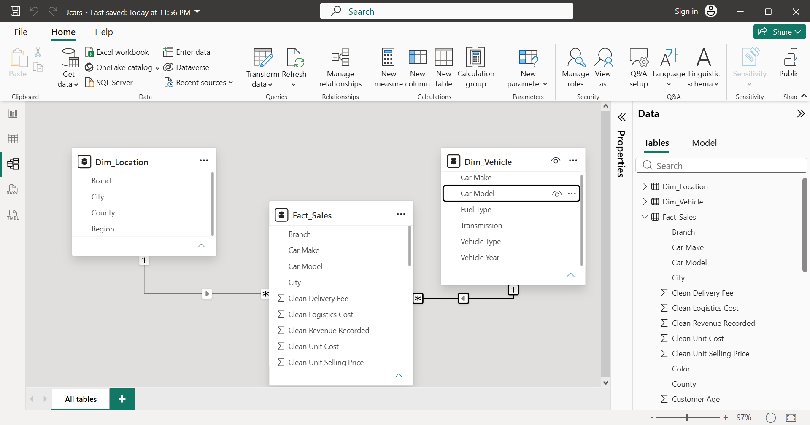

# End-to-End-Power-BI-Reporting-JCars
An end-to-end Power BI business intelligence solution analyzing sales, profitability, and logistics for JCars.
This repository contains a comprehensive Power BI solution developed for JCars Logistics. It demonstrates the ability to audit raw flat-file data, standardize international currencies, build an optimized analytical data model, and write explicit DAX measures to answer critical management questions regarding gross profit margins, delivery operations, and sales channel performance.
## Project Objective
The objective of this project is to develop an interactive Power BI solution for JCars Logistics to analyze sales, profitability, vehicle performance, and logistics efficiency. The project involves transforming a raw, messy flat dataset into a reliable analytical model to support management decision-making.

## 1. Data Quality Audit & Cleaning (Power Query)
Upon initial inspection of the `Jcars_data.csv` flat file, several data quality issues were identified and resolved using Power Query:
* **Inconsistent Text Formatting:** Columns like `Car Make`, `City`, and `Sales Rep` contained invisible spaces and mixed casing (e.g., "MARY", "Mary Wanjiku"). These were standardized using Trim, Clean, and Capitalize Each Word transformations.
* **Typographical Errors:** Identified and replaced manual data entry typos in the `Sales Rep` column (e.g., "Br1an" to "Brian", "A1sha" to "Aisha").
* **Mixed Date Formats:** The `Order Date` and `Delivery Date` columns contained a mix of standard text dates and Excel serial numbers (e.g., 46066). These were resolved before converting the columns to the Date data type.
* **String Percentages:** The `Discount` column was stored as text (e.g., "7%"). The percentage symbols were removed, and the values were divided by 100 to convert them into usable decimal numbers (0.07).
* **Missing/Invalid Values:** Text placeholders like "missing", "TBD", and Excel `#VALUE!` errors in financial columns were replaced with 0 to prevent DAX calculation errors.

## 2. Currency Standardization Approach
The monetary columns (`Unit Selling Price`, `Unit Cost`, `Delivery Fee`, `Logistics Cost`, and `Revenue Recorded`) contained mixed currencies (USD, ZAR, EUR/?, KES/KSh) and text suffixes ("M" for millions). 

To standardize all financial data to Kenya Shillings (KES) as required by management, a Custom Column M formula was applied to extract the numerical values and apply the following assumed exchange rates:
* **USD ($):** 130 KES
* **EUR (?):** 170 KES
* **ZAR (R):** 7 KES
* **Suffix "M":** Multiplied base value by 1,000,000

## 3. Data Validation
A critical validation check was performed by comparing the company's `Revenue Recorded` column against a mathematical calculation of true revenue (`Clean Unit Selling Price` * (1 - `Discount`) * `Units Sold`). 
* **Finding:** The recorded revenue contains significant discrepancies and negative error values, making it unreliable for management reporting. Moving forward, explicit DAX measures will be used to calculate true revenue and profitability.

## 4. Analytical Data Modeling (Star Schema)
The original dataset was provided as a raw flat table. To support efficient querying and time-based analysis, the flat file was transformed into a **Star Schema** analytical data model. 

The original table was separated into one Fact table and two Dimension tables using Power Query:
* **Dim_Location:** Created by referencing the main query, isolating geographic/branch columns (`Region`, `County`, `City`, `Branch`), and removing duplicates based on the `Branch` column to establish a unique primary key.
* **Dim_Vehicle:** Created by referencing the main query, isolating vehicle attributes (`Car Make`, `Car Model`, `Vehicle Type`, `Vehicle Year`, `Fuel Type`, `Transmission`), and removing duplicates based on `Car Model` to create a unique catalog of inventory.
* **Fact_Sales:** The main query was retained as the fact table, holding all transactional data, measurable values (Units Sold, Cleaned Monetary values), and foreign keys (`Branch`, `Car Model`).

**Relationships and Cardinality:**
* A **One-to-Many (1:*)** relationship was established between `Dim_Location[Branch]` and `Fact_Sales[Branch]`.
* A **One-to-Many (1:*)** relationship was established between `Dim_Vehicle[Car Model]` and `Fact_Sales[Car Model]`.
* Cross-filter direction was set to **Single** (Dimension filtering Fact) to prevent ambiguous filter contexts and optimize model performance.

## 5. Assumptions and Business Rules
To ensure consistent analysis, the following business rules and analytical assumptions were applied throughout the Power BI solution:

*   **Currency Standardization:** All financial metrics are reported in Kenya Shillings (KES). Where monetary values lacked an explicit currency, they were assumed to be in KES. For explicit foreign currencies, the following fixed exchange rates were applied via Power Query: 1 USD = 130 KES; 1 EUR/GBP (?) = 170 KES; 1 ZAR (R) = 7 KES.
*   **Revenue Definition:** The provided `Revenue Recorded` field contained calculation errors and unapplied discounts. True revenue was defined and calculated explicitly via DAX as: `(Clean Unit Selling Price * (1 - Discount)) * Units Sold`[cite: 1].
*   **Cost Definition:** Total cost was defined as the aggregate of the base vehicle cost (`Clean Unit Cost` * `Units Sold`), `Clean Logistics Cost`, and `Clean Delivery Fee`.
*   **Missing Values:** Text placeholders such as "missing", "TBD", and Excel `#VALUE!` errors in financial columns were treated as zero (0) to maintain data model integrity without dropping the entire transaction record.
*   **Missing Dates:** Transactions with null or missing delivery dates were retained, as they represent pending deliveries or administrative holdups rather than invalid data.

## 6. Key Insights & Recommendations

### Top 5 Business Insights
1. **Revenue Recording Inaccuracies:** The most critical finding from the data validation phase is that the manually entered `Revenue Recorded` column is highly unreliable. It frequently fails to account for applied discounts and contains raw data entry errors, resulting in severe discrepancies compared to true mathematical revenue.
2. **Margin Erosion via Logistics:** While certain heavy vehicle types (like SUVs and Trucks) generate high gross revenue, their proportional logistics and delivery costs are significantly higher than sedans, heavily eroding their final Gross Profit Margin.
3. **Branch Performance Variances:** Through drill-through analysis, it is evident that top-performing geographic branches drive the majority of sales volume, but smaller regional branches suffer from disproportionately high unit logistics costs.
4. **Currency Volatility Exposure:** With sales transactions occurring in mixed currencies (USD, EUR, ZAR, KES), the company's true revenue in KES is highly exposed to exchange rate fluctuations.
5. **Customer Satisfaction Correlation:** Initial drill-down analysis indicates a potential correlation between high logistics costs/complex deliveries and fluctuations in the Average Customer Rating, suggesting that delivery friction impacts the customer experience.

### Top 3 Strategic Recommendations
1. **Automate Point-of-Sale Calculations:** JCars Logistics must immediately configure their CRM/Sales software to automatically calculate final revenue at the point of sale (Price × Units - Discount) rather than allowing sales reps to manually type in the final revenue number. This will eliminate the negative error values and `#VALUE!` discrepancies found in the dataset.
2. **Revise Logistics Pricing for Heavy Vehicles:** Management should review the delivery fee structure for larger vehicle types. Passing a slightly higher percentage of the logistics cost to the customer for these specific vehicles will protect the Gross Profit Margin.
3. **Implement a Unified Base Currency Policy:** To simplify financial reporting and protect against currency volatility, JCars should standardize all regional sales price lists to a single base currency (KES), or implement a dynamic, daily-updated exchange rate multiplier in their backend system rather than relying on static conversions.
